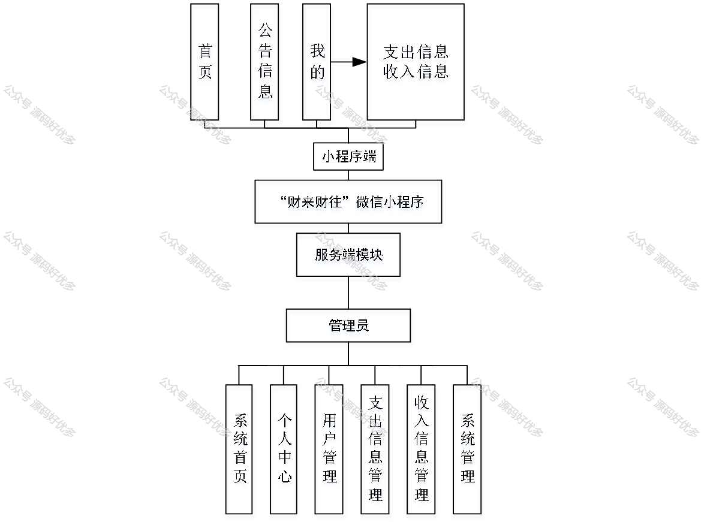
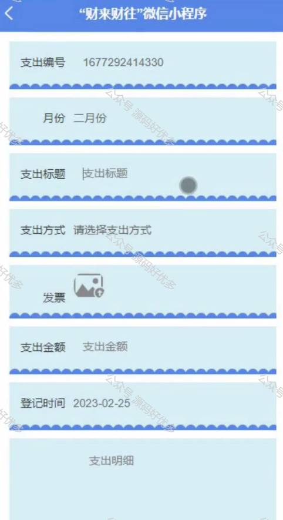
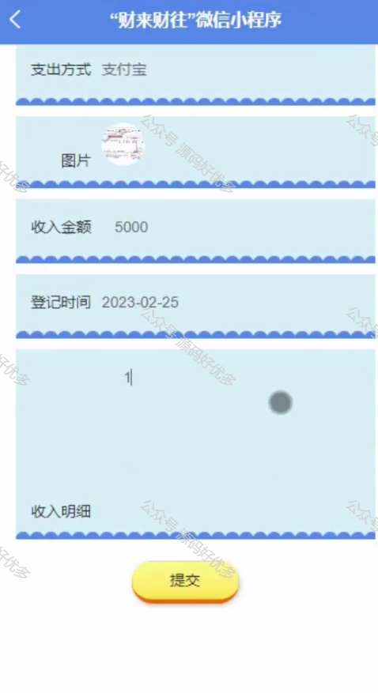
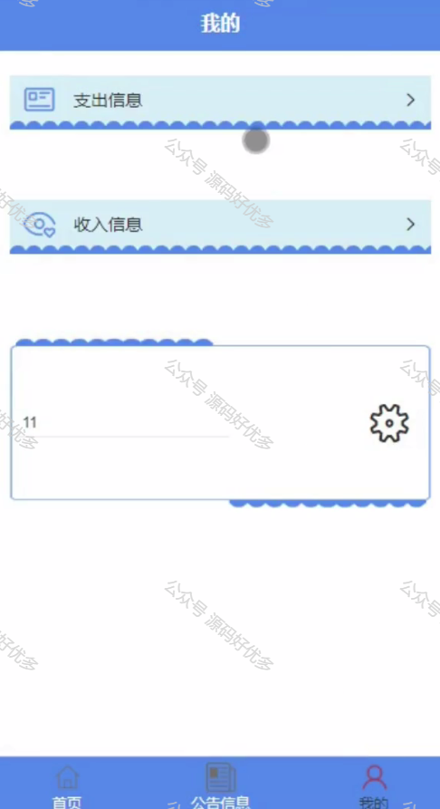
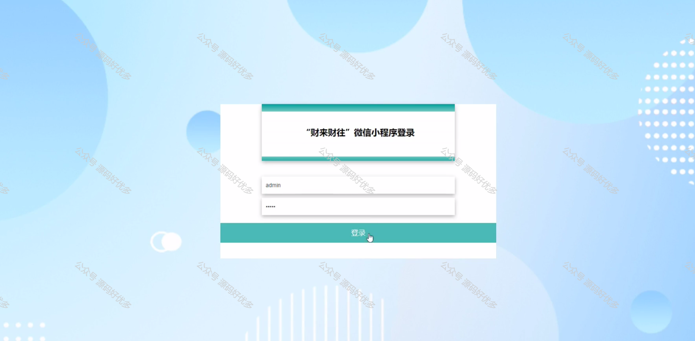
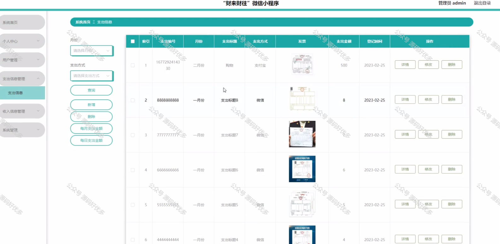
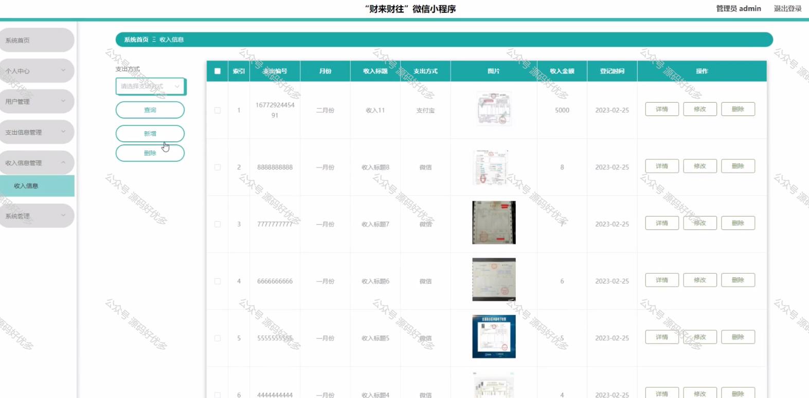
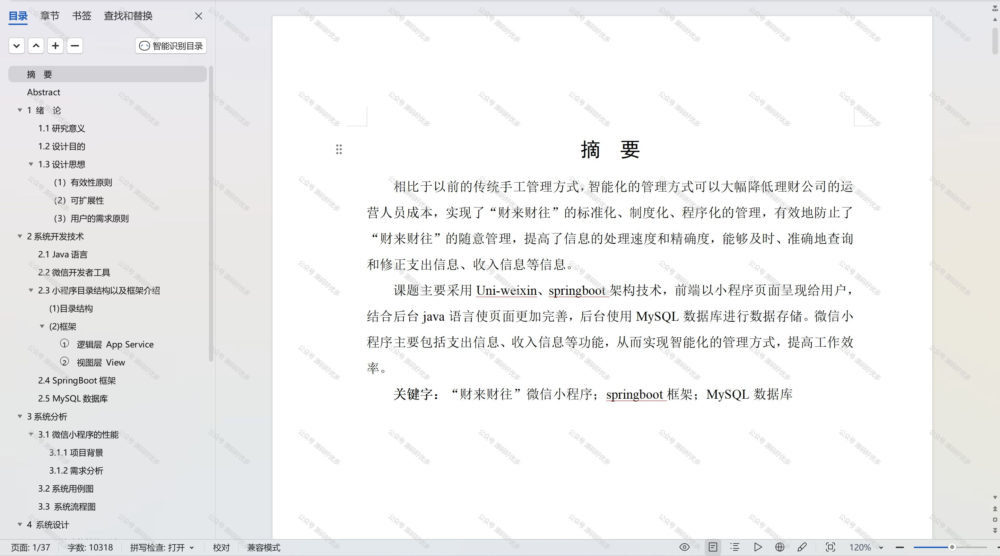

 
## 查看主页获取源码

> **作者介绍**： **✌**全网粉丝10W+本平台特邀作者、博客专家、CSDN新星计划导师、java领域优质创作者,博客之星、掘金/华为云/阿里云/InfoQ等平台优质作者、专注于项目实战 **✌**

  

### 一、作品包含

源码+数据库+设计文档万字+PPT+全套环境和工具资源+部署教程

### 二、项目技术

前端技术：Html、Css、Js、Vue、Element-ui

数据库：MySQL

后端技术：Java、Spring Boot、MyBatis

  

### 三、运行环境

开发工具：IDEA/eclipse + 微信开发者工具

数据库：MySQL5.7

数据库管理工具：Navicat10以上版本

环境配置软件： JDK1.8+Maven3.6.3

前端Nodejs：14

### 四、项目介绍
项目编号：mpweixinA006

“财来财往”微信小程序是一款便捷的个人财务管理工具，旨在帮助用户轻松记录和管理日常收支。通过这个小程序，用户可以随时随地进行交易记录、分类查看支出和收入，以及查看财务统计，从而更好地掌握自己的财务状况，实现智能化的个人理财。

前台用户功能：首页、公告信息、支出信息收入信息。

后台管理员的功能：系统首页、个人中心、用户管理、支出信息管理、收入信息管理、系统管理。

### 五、运行截图

  
